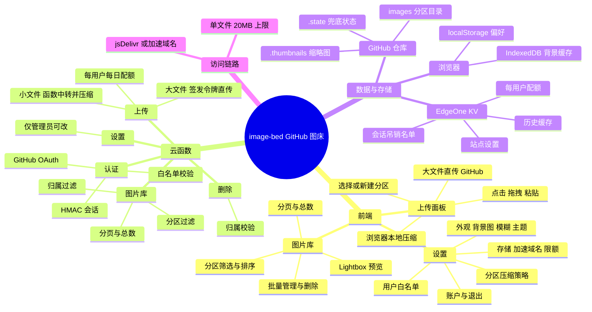

# image-bed

基于 GitHub 仓库的多用户图床：网页上传图片与视频，存入自己的 GitHub 仓库，通过 jsDelivr（或自定义加速域名）生成公开访问链接。部署在腾讯云 [EdgeOne Pages](https://edgeone.ai/document/160428830614245376)（静态前端 + Cloud Functions API），支持自定义域名。

前端为原生 ES Modules 单页应用（无框架、无构建），视觉采用明亮空气感（glassmorphism）风格，支持浅色 / 深色 / 跟随系统三态主题。

## 功能总览

- **多用户 + 数据全隔离**：管理员维护用户白名单，名单内用户用 GitHub 账号登录即可上传；每个用户只能看到、删除自己上传的内容，每日配额按用户独立计算；管理员可见并管理全部图片
- **上传**：点击 / 拖拽 / 剪贴板粘贴，支持 PNG/JPG/GIF/WebP 与 MP4；图片在上传前自动本地压缩（长边 ≤2560、WebP q0.85，比原图小才采用）
- **大文件直传**：超过函数请求体上限的文件（视频一律、大图）由浏览器持 GitHub 短期安装令牌**直接 PUT 到 GitHub API**，不经过 Cloud Functions
- **分区**：上传时选择或输入新分区名（自动创建），文件存入 `images/<分区名>/年/月/`；每个分区可单独配置"保留原图"（跳过压缩）
- **图片库**：分区筛选、排序、分页（显示总页数）、批量管理、复制 URL/Markdown、Lightbox 大图与视频预览
- **站点设置**（仅管理员）：背景图与模糊度、图片加速域名、每日限额、单张大小上限（≤20MB）、分区压缩策略、用户白名单
- **图片链接公开**：任何拿到链接的人都能访问；请勿上传敏感内容
- **会话安全**：HMAC 签名 cookie（24 小时），退出即服务端吊销

## 权限模型

| 角色 | 登录 | 上传 | 图片库 | 站点设置 | 用户管理 |
|---|---|---|---|---|---|
| **管理员**（`ALLOWED_GITHUB_LOGIN`） | ✅ | ✅ | 可见全部 | ✅ | ✅ |
| **白名单用户**（设置 → 用户） | ✅ | ✅ | 仅自己的 | ❌（接口 403） | ❌ |
| **未登录访客** | 可发起登录 | ❌ | ❌ | ❌ | ❌ |

白名单支持 **GitHub 用户名或公开邮箱**；推荐填用户名（唯一且稳定）。不在名单内的账号在 OAuth 授权后被拒绝。

## 架构思维导图



## 上传路由与大小限制

| 文件 | 路径 | 限制 |
|---|---|---|
| 图片，压缩后 ≤5MB | 浏览器 → Cloud Functions（服务端再压缩转 WebP）→ GitHub | 单张 ≤20MB |
| 图片，压缩后仍 >5MB（含"保留原图"分区） | 浏览器 → **直传** GitHub API | ≤20MB |
| MP4 视频 | 浏览器 → **直传** GitHub API（客户端截帧生成封面） | ≤20MB |

> **20 MB 是 jsDelivr 的单文件分发上限**：超限文件虽能存入 GitHub，但 CDN 链接无法访问。EdgeOne 函数另有 6MB 请求体上限，这是大文件直传存在的原因。

## 页面与目录结构

```text
index.html / app.js / styles.css   页面入口、交互逻辑与玻璃拟态视觉系统
fonts/                              自托管开源字体 Noto Sans SC（SIL OFL，三档字重）
logo.jpg / favicon.*                品牌 Logo 与站点图标
cloud-functions/                   EdgeOne Cloud Functions API
  ├─ _lib/                          鉴权、GitHub App、状态存储、分区与 HTTP 工具
  └─ api/                           OAuth、上传（中转/令牌/登记）、图片库、删除、设置、配额、健康检查
scripts/deploy-cli.sh              直传部署 staging 打包脚本
tests/                              Node 内置测试
```

首页为 Hero + 登录引导 / 上传主面板；图片库提供排序、分区筛选、批量管理与分页；设置面板分"外观 / 存储 / 分区 / 用户 / 账户"五个标签页（用户与部分存储项仅管理员可见）。

## 环境变量

在 EdgeOne Pages 控制台 → 项目 → 环境变量配置（生效环境勾选 Production 和 Preview）：

| 变量 | 说明 |
|---|---|
| `GITHUB_APP_ID` | GitHub App 的数字 ID（App 设置页顶部） |
| `GITHUB_APP_CLIENT_ID` | App 的 Client ID（`Iv23li...`） |
| `GITHUB_APP_CLIENT_SECRET` | 生成 Client secret 得到 |
| `GITHUB_APP_INSTALLATION_ID` | App 安装到仓库后，安装页 URL 里的数字 ID |
| `GITHUB_APP_PRIVATE_KEY_B64_1/_2/_3` | 私钥 PEM **整个文件**的 base64，拆成三段（见下文） |
| `SESSION_SECRET` | 会话签名密钥，`openssl rand -hex 32` 生成 |
| `PUBLIC_BASE_URL` | `https://images.example.com`（OAuth 回调基于它构造） |
| `GITHUB_OWNER` / `GITHUB_REPO` | 图片仓库，如 `cyz-domo` / `image-bed` |
| `ALLOWED_GITHUB_LOGIN` | **管理员**的 GitHub 用户名（始终拥有全部权限） |
| `MAX_FILE_SIZE` | 上传大小上限（字节），默认 10485760（10 MB） |
| `DAILY_UPLOAD_LIMIT` | **每用户**每日上传张数上限，默认 100 |

### KV 存储（推荐配置）

状态数据（会话吊销名单、每用户配额计数、站点设置、用户归属记录、历史列表缓存）优先存放在 EdgeOne KV 中，未绑定时回退到仓库 `.state/state.json`（产生少量 `chore: update state` 提交）。切换到 KV：

1. EdgeOne 控制台 → 存储空间（KV）→ 开通账户（免费额度 1GB）；
2. 创建 Namespace（名称随意，如 `image-bed`）；
3. 项目详情 → KV Storage → Bind Namespace，**环境变量名必须为 `IMAGE_KV`**；每日配额要求该 KV 提供原子 `incr`/`increment` 方法，否则配额接口返回 503，避免并发绕过上限；
4. 重新部署后生效。KV 为最终一致（其他节点最多延迟约 60 秒），吊销状态读取失败时敏感接口 fail-closed。

绑定 KV 的收益：上传/退出不再产生仓库提交；历史列表在所有边缘实例间共享缓存（10 分钟）。

### 私钥的三段式配置（重点）

EdgeOne 环境变量**上限 1000 字符**，而 GitHub App 私钥的 base64 约 2236 字符，需要拆成三段（每段 <1000）。base64 的对象是**整个 `.pem` 文件**（含 BEGIN/END 行），服务端会自动剥头并识别 PKCS#1/PKCS#8：

```bash
B64=$(base64 -i image-bed.*.private-key.pem | tr -d '\n')
echo -n "${B64:0:700}"   | pbcopy   # → GITHUB_APP_PRIVATE_KEY_B64_1
echo -n "${B64:700:700}" | pbcopy   # → GITHUB_APP_PRIVATE_KEY_B64_2
echo -n "${B64:1400}"    | pbcopy   # → GITHUB_APP_PRIVATE_KEY_B64_3
```

也可用单个 `GITHUB_APP_PRIVATE_KEY_B64`（本地开发/其他平台无长度限制时适用）。

> EdgeOne 控制台对较长粘贴值有时提示"当前值不能为空"——确认每段 <1000 字符、输入框有值再保存。

## 从零部署到 EdgeOne Pages

### 第一步：建图片仓库

创建**公开仓库**（jsDelivr 只缓存公开仓库），即 `GITHUB_OWNER/GITHUB_REPO`。

### 第二步：创建并配置 GitHub App（关键步骤）

在 https://github.com/settings/apps/new 创建：

- Homepage URL 填站点域名；Callback URL：`https://images.example.com/api/auth/callback`
- **勾选 Request user authorization (OAuth) during installation**；Webhook 可不勾
- Repository permissions：**Contents: Read and write**
- （可选）Account permissions → **Email addresses: Read-only**——仅在打算用"邮箱"匹配用户白名单时需要；用用户名匹配则不需要
- 创建后记录 App ID、Client ID，生成 Client secret，**Generate a private key** 下载 `.pem`

**⚠️ 必做：把 App 设为公开。** 在 App 的 General 设置页 → About 区域 → **Make public**。

> 私有 App 只有 App 所有者能看到，**其他用户访问授权链接会得到 GitHub 404**（页面为 "Page not found · /login/oauth/authorize"），表现为新用户无法登录。这是最容易踩的坑。

### 第三步：安装 App 到图片仓库

安装页 URL `https://github.com/apps/<app-name>/installations/<数字>` 中的数字即 Installation ID。

### 第四步：EdgeOne Pages 项目

1. 控制台新建项目，关联本仓库的 **`dev-edgeone` 分支**，push 该分支即自动部署；
2. 构建命令留空（无前端打包步骤，`sharp` 由平台按 `package.json` 安装）；
3. Functions 运行时需支持 Node.js 依赖（Cloud Functions），**不能选纯 Edge Functions**（不支持 `sharp`）；
4. 按上表配置全部环境变量（含三段私钥），绑定 KV（推荐）。

### 第五步：部署后自检

```bash
curl -s https://images.example.com/api/health        # {"ok":true,"missing":[]}
curl -s https://images.example.com/api/auth/me       # {"authenticated":false}
curl -sI https://images.example.com/api/auth/login   # 302 → github.com/login/oauth/authorize
```

### 第六步：登录与添加用户

1. 管理员（`ALLOWED_GITHUB_LOGIN` 账号）登录后，右上角头像 → 设置 → **用户**；
2. 输入对方的 **GitHub 用户名**（推荐）或公开邮箱 → 点 **+** → **保存设置**；
3. 对方访问站点点"使用 GitHub 登录"，授权后即可上传；只能看到自己上传的内容。

## 踩坑记录（排障时先看这里）

- **其他用户授权 404（"Page not found · /login/oauth/authorize"）**：GitHub App 是私有状态，去 App 设置 **Make public** 即可。
- **邮箱白名单匹配不到**：GitHub 的 `/user` 接口通常不返回邮箱；需要在 App 开启 Email addresses 权限，或改用用户名匹配。
- **大视频上传崩溃（500 函数崩溃页）**：EdgeOne 函数请求体上限 **6MB**，超大文件必须走直传（本站已实现）；上传进度若卡在"函数中转"报 500，先确认文件是否超限。
- **链接提示 File size exceeded 20 MB**：jsDelivr 单文件分发上限，删除超限文件换 ≤20MB 的版本。
- **所有 API 默认 `Cache-Control: no-store`**：边缘缓存曾把匿名 `/api/auth/me` 的"未登录"响应缓存住，导致登录成功仍显示未登录；OAuth 回调 302 也必须 `no-store`。
- **回调 302 只发一个 Set-Cookie**：平台/前置代理层对带两个 Set-Cookie 的响应会丢 cookie。`oauth_state` 的清除挪到了 `/api/auth/me` 顺带完成。
- **上传按字节嗅探格式**：浏览器按扩展名上报 MIME，`.png` 实为 JPEG 的图曾触发校验失败；现以文件真实内容判定。
- **私钥是 PKCS#1**：`crypto.subtle` 只认 PKCS#8，服务端已自动包装转换。
- **新用户首次登录后图片库为空**：数据隔离的预期行为——各用户只看自己的；分区列表在打开图片库或上传后会自动建立。

## 分支与部署策略

- `main`：开发主线，普通 push 不触发正式部署。
- `dev-edgeone`：EdgeOne Pages 绑定分支，push 后自动部署（约 1–2 分钟）。
- 网页上传/删除由 GitHub App 提交到图片仓库的 `main`，与部署分支无关。
- 同步主线到部署分支：`git push origin main:dev-edgeone`。推荐在 `main` 开发并验证后再推送。

### CLI 直传（仅限纯静态预览）

```bash
edgeone makers deploy --env production          # 已 link 的项目
edgeone makers deploy --name <项目名> --env production --json   # 新项目
```

- **⚠️ 实测限制（2026-08）**：直传型项目的云函数加载 `sharp` 会崩溃（所有 `/api/*` 502），**完整功能必须走 git 分支部署**，直传只适合前端预览。
- 直传不继承环境变量，需 `edgeone makers env set <KEY> <VALUE>` 逐项配置；只打包必要文件（排除 `.env`、`node_modules`、`images/`、`.git`，见 `scripts/deploy-cli.sh`）。
- 预览 URL 带 `eo_token`，需浏览器先访问种 cookie；正式域名不受影响。
- CLI 无删除项目 API，测试项目需到控制台手动删除。

## 本地开发与测试

```bash
npm install
npm run dev       # 静态服务器，默认 http://localhost:8000/
npm test          # Node 内置测试
npm run check     # 前端入口与全部 Cloud Functions 语法检查
```

完整登录、上传、删除流程需在配置好 OAuth、GitHub App 和 KV 的 EdgeOne 环境验证。本地调试可用 EdgeOne CLI（读 `.env` 变量）：

```bash
npm install -g edgeone && edgeone login
edgeone makers link     # 或 edgeone makers dev -n <项目名>
edgeone makers dev      # http://localhost:8088/
```

## 命令行上传（备用）

不登录网页也可用 `gh` CLI 上传（原样保存，不转 WebP，无 20MB 校验）：

```bash
bash upload-image.sh /path/to/image.png [more.png ...]
```

## 链接格式

```text
https://cdn.jsdelivr.net/gh/<owner>/<repo>@main/images/YYYY/MM/<file>.webp
```

配置了加速域名时，域名部分替换为加速域名，其余路径一致。

## 注意

- 仓库必须保持公开，jsDelivr 才能读取；**图片公开可访问，不要上传敏感内容**。
- jsDelivr 有缓存，同路径更新后可能短暂返回旧内容；本站使用随机文件名，天然规避。
- 所有文件 ≤20MB（jsDelivr 上限）；图片库内容按登录用户隔离，但链接本身是公开的。
- `.env`、`*.pem`、`images/` 已在 `.gitignore`，私钥只放 EdgeOne 环境变量。
- 私钥泄露时，在 GitHub App 设置页 Generate a new private key 换新并更新环境变量重新部署。
- GitHub App 令牌（直传用）约 1 小时有效，仅签发给已登录的白名单用户，权限限图片仓库 Contents 读写。
