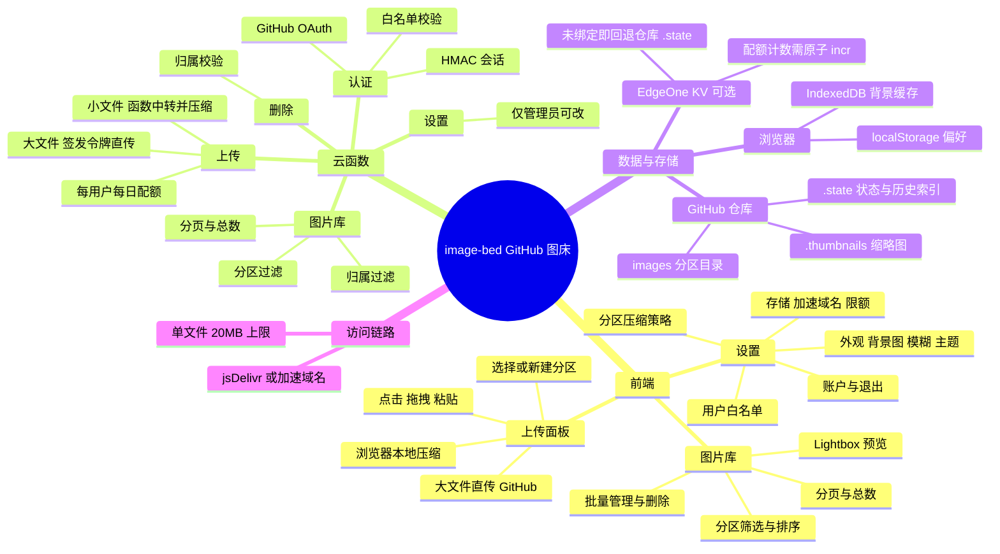

# image-bed

基于 GitHub 仓库的多用户图床：网页上传图片与视频，存入自己的 GitHub 仓库，通过 jsDelivr（或自定义加速域名）生成公开访问链接。部署在腾讯云 [EdgeOne Pages](https://edgeone.ai/document/160428830614245376)（静态前端 + Cloud Functions API），支持自定义域名。

前端为原生 ES Modules 单页应用（无框架、无构建），视觉采用明亮空气感（glassmorphism）风格，支持浅色 / 深色 / 跟随系统三态主题。

## 功能总览

- **多用户 + 数据全隔离**：管理员维护用户白名单，名单内用户用 GitHub 账号登录即可上传；每个用户只能看到、删除自己上传的内容，每日配额按用户独立计算；管理员可见并管理全部图片
- **上传**：点击 / 拖拽 / 剪贴板粘贴，支持 PNG/JPG/GIF/WebP 与 MP4；图片在上传前自动本地压缩（长边 ≤2560、WebP q0.85，比原图小才采用）
- **大文件直传**：超过函数请求体上限的文件（视频一律、大图）由浏览器持 GitHub 短期安装令牌**直接 PUT 到 GitHub API**，不经过 Cloud Functions
- **分区**：上传时选择或输入新分区名（自动创建），文件存入 `images/<分区名>/年/月/`；每个分区可单独配置"保留原图"（跳过压缩）
- **图片库**：分区筛选、排序、分页（显示总页数）、批量管理、复制 URL/Markdown、Lightbox 大图与视频预览
- **站点设置**（仅管理员）：背景图与模糊度、图片加速域名、每日限额、单张大小上限（≤20MB）、分区压缩策略、用户白名单
- **图片链接公开**：任何拿到链接的人都能访问；请勿上传敏感内容
- **会话安全**：HMAC 签名 cookie（24 小时），退出即服务端吊销

## 权限模型

| 角色 | 登录 | 上传 | 图片库 | 站点设置 | 用户管理 |
|---|---|---|---|---|---|
| **管理员**（`ALLOWED_GITHUB_LOGIN`） | ✅ | ✅ | 可见全部 | ✅ | ✅ |
| **白名单用户**（`ALLOWED_USERS` 或设置 → 用户） | ✅ | ✅ | 仅自己的 | ❌（接口 403） | ❌ |
| **未登录访客** | 可发起登录 | ❌ | ❌ | ❌ | ❌ |

白名单支持 **GitHub 用户名或公开邮箱**；推荐填用户名（唯一且稳定）。不在名单内的账号在 OAuth 授权后被拒绝。
配置了环境变量 `ALLOWED_USERS` 时以它为准，站点设置里的旧名单当场失效；未配置时仍读站点设置（图片仓库公开，写在设置里的名单可被任何人取到）。

## 架构思维导图


```mermaid
mindmap
  root((image-bed GitHub 图床))
    前端
      上传面板
        点击 拖拽 粘贴
        选择或新建分区
        浏览器本地压缩
        大文件直传 GitHub
      图片库
        分区筛选与排序
        分页与总数
        批量管理与删除
        Lightbox 预览
      设置
        外观 背景图 模糊 主题
        存储 加速域名 限额
        分区压缩策略
        用户白名单
        账户与退出
    云函数
      认证
        GitHub OAuth
        白名单校验
        HMAC 会话
      上传
        小文件 函数中转并压缩
        大文件 签发令牌直传
        每用户每日配额
      图片库
        归属过滤
        分区过滤
        分页与总数
      删除
        归属校验
      设置
        仅管理员可改
    数据与存储
      GitHub 仓库
        images 分区目录
        .thumbnails 缩略图
        .state 状态与历史索引
      EdgeOne KV 可选
        未绑定即回退仓库 .state
        配额计数需原子 incr
      浏览器
        IndexedDB 背景缓存
        localStorage 偏好
    访问链路
      jsDelivr 或加速域名
      单文件 20MB 上限
```

## 上传路由与大小限制

| 文件 | 路径 | 限制 |
|---|---|---|
| 图片，压缩后 ≤5MB | 浏览器 → Cloud Functions（服务端再压缩转 WebP）→ GitHub | 单张 ≤20MB |
| 图片，压缩后仍 >5MB（含"保留原图"分区） | 浏览器 → **直传** GitHub API | ≤20MB |
| MP4 视频 | 浏览器 → **直传** GitHub API（客户端截帧生成封面） | ≤20MB |

> **20 MB 是 jsDelivr 的单文件分发上限**：超限文件虽能存入 GitHub，但 CDN 链接无法访问。EdgeOne 函数另有 6MB 请求体上限，这是大文件直传存在的原因。

## 页面与目录结构

```text
index.html / app.js / styles.css   页面入口、交互逻辑与玻璃拟态视觉系统
fonts/                              自托管开源字体 Noto Sans SC（SIL OFL，三档字重）
logo.jpg / favicon.*                品牌 Logo 与站点图标
cloud-functions/                   EdgeOne Cloud Functions API
  ├─ _lib/                          鉴权、GitHub App、状态存储、分区与 HTTP 工具
  └─ api/                           OAuth、上传（中转/令牌/登记）、图片库、删除、设置、配额、健康检查
scripts/deploy-cli.sh              直传部署 staging 打包脚本
docs/deployment.md                 从零部署指南（变量清单、自检、按症状排障）
tests/                              Node 内置测试
```

首页为 Hero + 登录引导 / 上传主面板；图片库提供排序、分区筛选、批量管理与分页；设置面板分"外观 / 存储 / 分区 / 用户 / 账户"五个标签页（用户与部分存储项仅管理员可见）。

## 部署

从零部署的完整流程——GitHub App 配置、变量清单、EdgeOne 项目设置、部署后自检、按症状排障——在 **[docs/deployment.md](./docs/deployment.md)**。

需要配置的变量共 12 项：`GITHUB_APP_ID` / `GITHUB_APP_CLIENT_ID` / `GITHUB_APP_CLIENT_SECRET` / `GITHUB_APP_INSTALLATION_ID` / `GITHUB_APP_PRIVATE_KEY_B64_1~3`、`SESSION_SECRET`、`PUBLIC_BASE_URL`、`GITHUB_OWNER`、`GITHUB_REPO`、`ALLOWED_GITHUB_LOGIN`、`ALLOWED_USERS`、`MAX_FILE_SIZE`、`DAILY_UPLOAD_LIMIT`。模板见 [.env.example](./.env.example)，每项的取值来源与作用见部署文档第 4 步。

### 平台限制速查

| 限制 | 数值 | 后果 |
|---|---|---|
| EdgeOne 函数请求体 | 6 MB | 更大的文件必须由浏览器直传 GitHub API |
| jsDelivr 单文件分发 | 20 MB | 超限文件存得进仓库，但 CDN 链接取不到 |
| EdgeOne 单个环境变量值 | 1000 字符 | GitHub App 私钥的 base64 要拆成三段 |
| 未匹配到的路径 | 回落 `index.html`，仍是 HTTP 200 | 判断接口是否存在不能只看状态码 |
| 静态资源自定义响应头 | 只认 `edgeone.json` 的 `headers` | `_headers` 文件不被 Pages 采纳 |

## 开发注意事项（改代码前看）

- **所有 API 必须 `Cache-Control: no-store`**：边缘缓存曾把匿名 `/api/auth/me` 的"未登录"响应缓存住，导致登录成功仍显示未登录；OAuth 回调的 302 同样要 `no-store`。
- **回调 302 只发一个 Set-Cookie**：平台/前置代理层对带两个 Set-Cookie 的响应会丢 cookie，`oauth_state` 的清除因此挪到了 `/api/auth/me` 顺带完成。
- **上传按字节嗅探格式**：浏览器按扩展名上报 MIME，`.png` 实为 JPEG 的图曾触发校验失败；现以文件真实内容判定。
- **私钥是 PKCS#1**：`crypto.subtle` 只认 PKCS#8，服务端已自动包装转换。
- **状态没有 KV 时落进仓库**：会话吊销、每日配额、站点设置、用户归属与历史索引存在 `.state/`（写入产生 `chore: update state` 提交），实例内各有 15/30 秒记忆，别把它当强一致读。
- **图片仓库是 public**：`.state/` 与图片文件本身对外可直接取用，登录门禁只作用于界面与数据隔离展示。

## 分支与部署策略

- `main`：开发主线，普通 push 不触发正式部署。
- `dev-edgeone`：EdgeOne Pages 绑定分支，push 后自动部署（约 1–3 分钟）。
- 网页上传/删除由 GitHub App 提交到图片仓库的 `main`，与部署分支无关。
- 同步主线到部署分支：`git push origin main:dev-edgeone`。推荐在 `main` 开发并验证后再推送。
- 判定部署是否生效看 `/api/health` 的 `build`：`fingerprint` 由上线文件内容算出，代码没变则不变，`short`/`time` 随提交变化。静态资源有缓存，光看页面容易误判。

### CLI 直传（仅限纯静态预览）

```bash
edgeone makers deploy --env production          # 已 link 的项目
edgeone makers deploy --name <项目名> --env production --json   # 新项目
```

- **⚠️ 实测限制（2026-08）**：直传型项目的云函数加载 `sharp` 会崩溃（所有 `/api/*` 502），**完整功能必须走 git 分支部署**，直传只适合前端预览。
- 直传不继承环境变量，需 `edgeone makers env set <KEY> <VALUE>` 逐项配置；只打包必要文件（排除 `.env`、`node_modules`、`images/`、`.git`，见 `scripts/deploy-cli.sh`）。
- 预览 URL 带 `eo_token`，需浏览器先访问种 cookie；正式域名不受影响。
- CLI 无删除项目 API，测试项目需到控制台手动删除。

## 本地开发与测试

```bash
npm install
npm run dev       # 静态服务器，默认 http://localhost:8000/
npm test          # Node 内置测试
npm run check     # 前端入口与全部 Cloud Functions 语法检查
```

完整登录、上传、删除流程需在配置好 OAuth 与 GitHub App 的 EdgeOne 环境验证（不绑定 KV 也能跑，状态走仓库 `.state`）。本地调试可用 EdgeOne CLI（读 `.env` 变量）：

```bash
npm install -g edgeone && edgeone login
edgeone makers link     # 或 edgeone makers dev -n <项目名>
edgeone makers dev      # http://localhost:8088/
```

## 命令行上传（备用）

不登录网页也可用 `gh` CLI 上传（原样保存，不转 WebP，无 20MB 校验）：

```bash
bash upload-image.sh /path/to/image.png [more.png ...]
```

## 链接格式

```text
https://cdn.jsdelivr.net/gh/<owner>/<repo>@main/images/YYYY/MM/<file>.webp
```

配置了加速域名时，域名部分替换为加速域名，其余路径一致。

## 注意

- 仓库必须保持公开，jsDelivr 才能读取；**图片公开可访问，不要上传敏感内容**。
- jsDelivr 有缓存，同路径更新后可能短暂返回旧内容；本站使用随机文件名，天然规避。
- 所有文件 ≤20MB（jsDelivr 上限）；图片库内容按登录用户隔离，但链接本身是公开的。
- `.env`、`*.pem`、`images/` 已在 `.gitignore`，私钥只放 EdgeOne 环境变量。
- 私钥泄露时，在 GitHub App 设置页 Generate a new private key 换新并更新环境变量重新部署。
- GitHub App 令牌（直传用）约 1 小时有效，仅签发给已登录的白名单用户，权限限图片仓库 Contents 读写。
